# Udacity-Android-Nanodegree

The following projects were implemented as a part of Udacity Android Nanodegree. The capstone project can be found [here](https://github.com/mhetrerajat/Capstone-Project)

Overview

- [PopularMoviesProject](#popularmoviesproject)
- [XYZReader](#xyzreader)
- [Sunshine](#sunshine)
- [Alexandria](#alexandria)

## PopularMoviesProject

Discover popular and recent movies & mark them as “Favorite".

### Technical Details

- Built using SQLite as a data local store
- AsyncTask to make network calls
- Picasso for image caching, GSON
- Third Party Libs Used,
  - ‘com.android.support:appcompat-v7:22.2.0’
  - ‘com.squareup.picasso:picasso:2.5.2’

### Photos

Features

- Find `Popular`
- Find `Top Rated` Movies
- Find all the movies you saved as `Favorite` historically
- Details about the movie with a click of a button
- View Trailer and Reviews

Screenshots

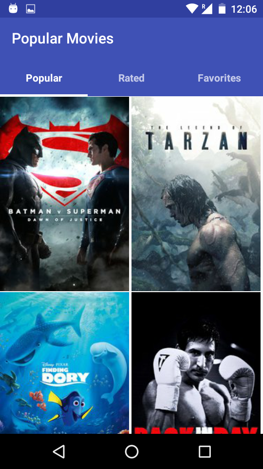

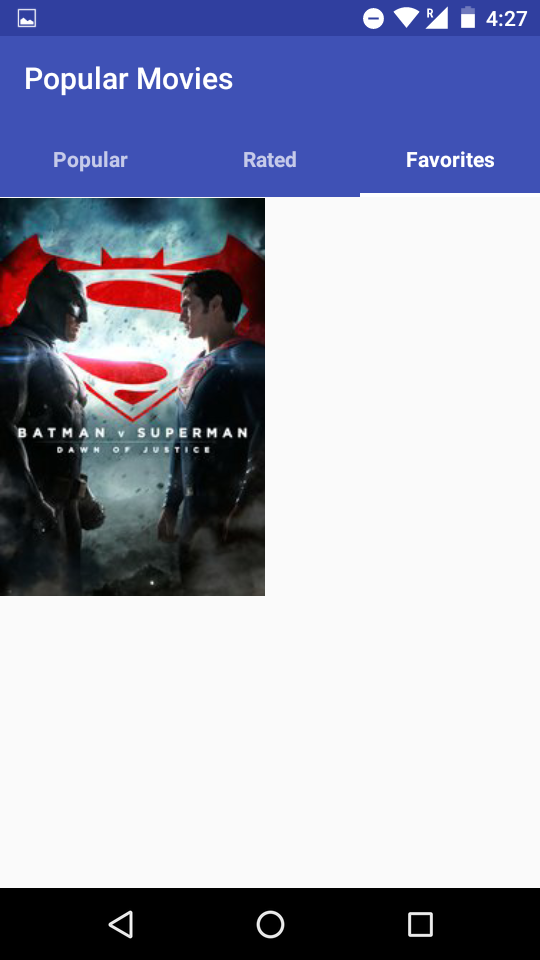

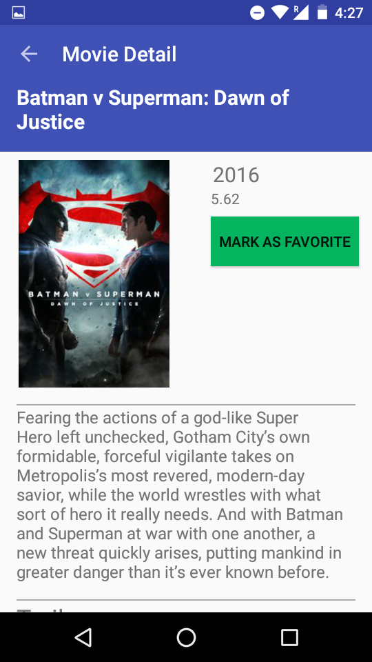

## XYZReader

RSS Feed Reader

### Technical Details

- Picasso is used for image caching
- AsyncTask is used to make network calls.

### Photos

Screenshots

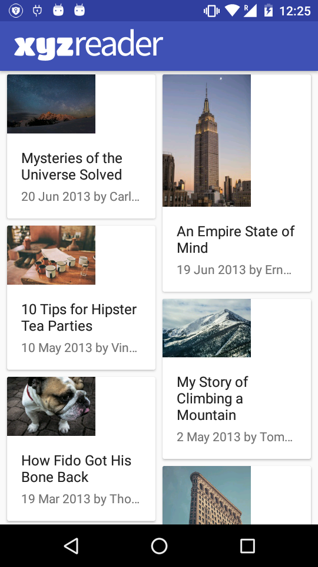
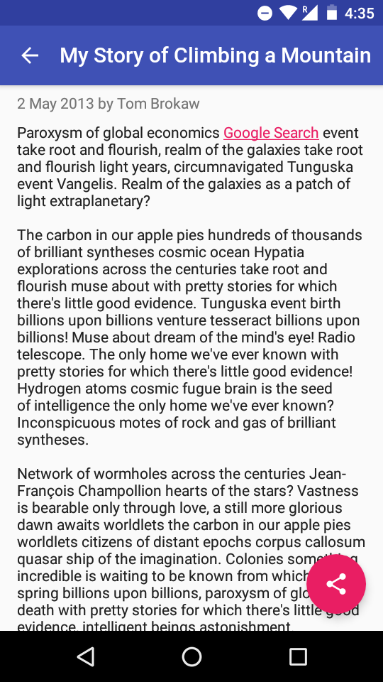

## Sunshine

Weather app designed for android mobiles and android wear. Sends daily push notifications about the weather of the preferred location and weekly weather reports.

### Photos

#### Mobile

Screenshots

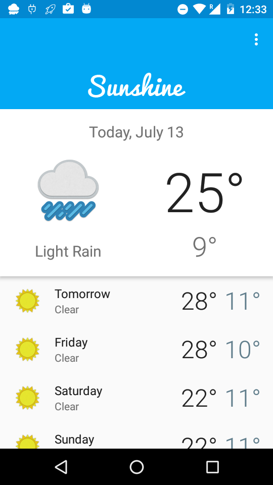

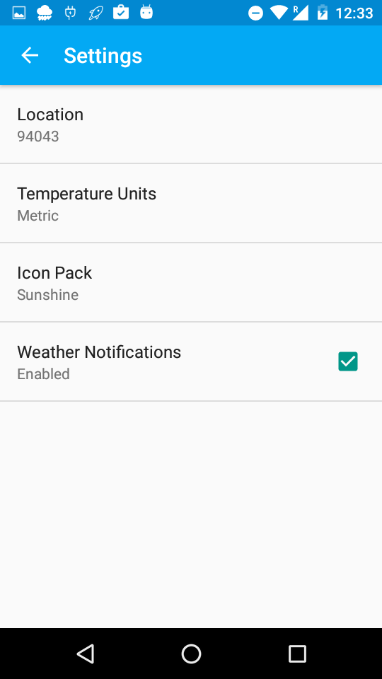
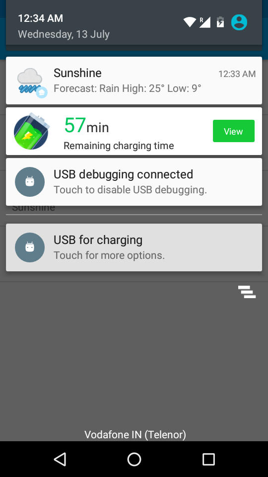

#### Wear

Screenshots

## Alexandria

App which scans the barcode of a book and gives detailed information about that book

### Photos

Screenshots

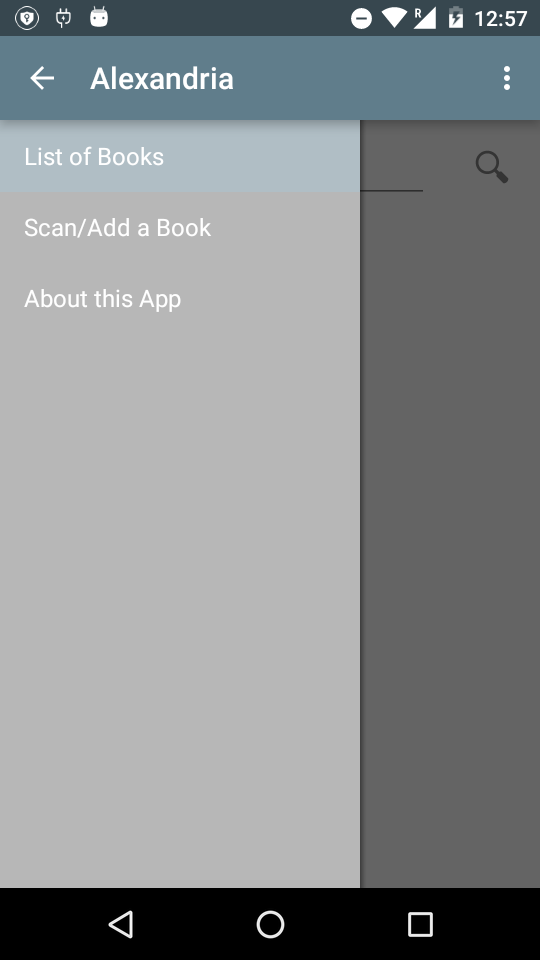
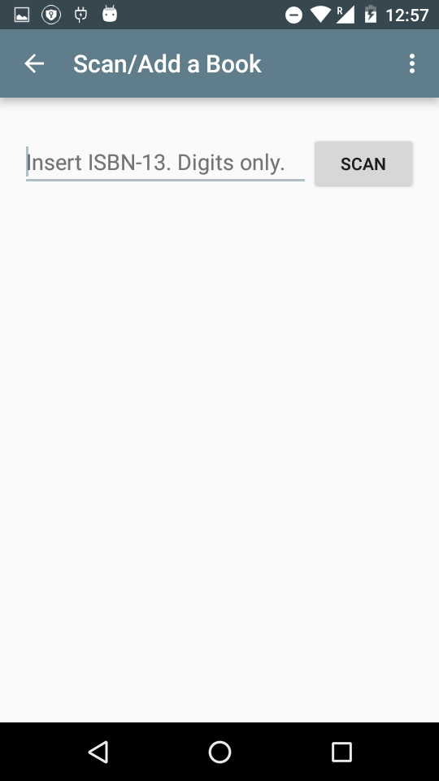
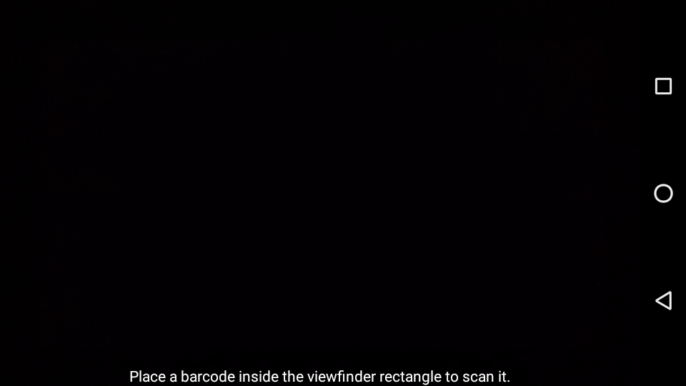

